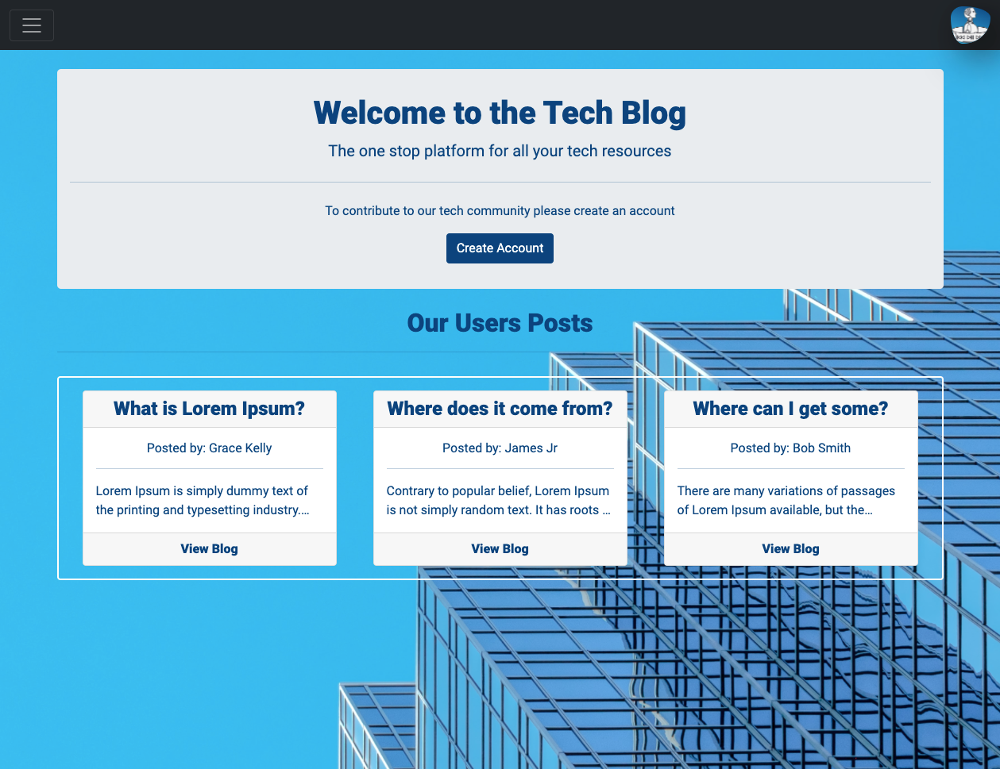
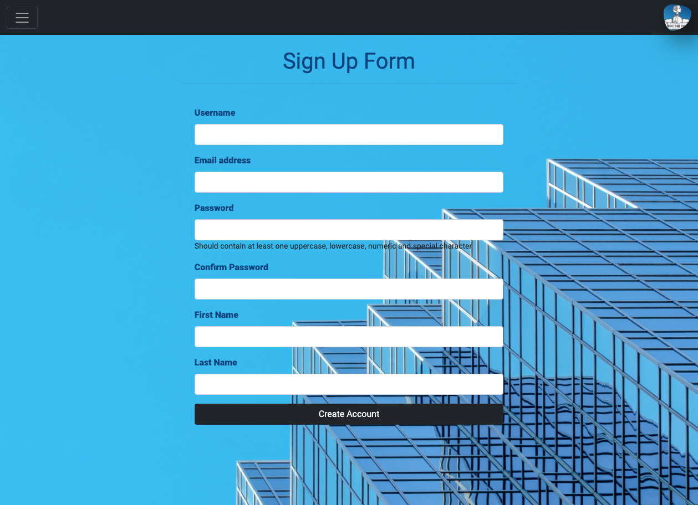
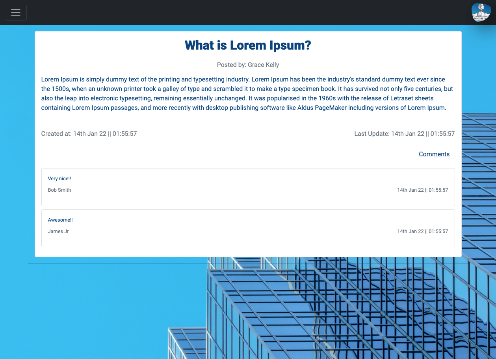

## The Tech Blog

#### Check the deployed app [here](https://agile-beyond-75908.herokuapp.com/)

## Table of Contents

- [Summary](#summary)
- [User Story](#user-story)
- [Technologies Used](#technologies)
- [Acceptance Criteria](#acceptance-criteria)
- [Languages](#languages)
- [Installation](#installation)
- [RESTful APIs](#restful-api)
- [License](#license)
- [Questions](#questions)

<a name="summary"></a>

## Summary

Writing about tech can be just as important as making it. Developers spend plenty of time creating new applications and debugging existing codebases, but most developers also spend at least some of their time reading and writing about technical concepts, recent advancements, and new technologies. That's the idea behind this project.

The Tech Blog is a is a fully responsive CMS-style blog site similar to a Wordpress site, where users can create, read, update and delete their posts and comment on other users posts as well. The app has an authentication system with protected routes that allows user access to certain functions and pages once authorized. Users are able to use the CRUD functionalities if they were the authors of the blog; however all other authorized users are able to comment on any blog.

The app follow the MVC paradigm in its architectural structure, using Handlebars.js as the templating language, Sequelize as the ORM, the express-session npm package for authentication and express as the server.



<a name="user-story"></a>

## User Story

```md
AS A developer who writes about tech
I WANT a CMS-style blog site
SO THAT I can publish articles, blog posts, and my thoughts and opinions
```

<a name="acceptance-criteria"></a>

## Acceptance Criteria

```md
GIVEN a CMS-style blog site
WHEN I visit the site for the first time
THEN I am presented with the homepage, which includes existing blog posts if any have been posted; navigation links for the homepage and the dashboard; and the option to log in
WHEN I click on the homepage option
THEN I am taken to the homepage
WHEN I click on any other links in the navigation
THEN I am prompted to either sign up or sign in
WHEN I choose to sign up
THEN I am prompted to create a username and password
WHEN I click on the sign-up button
THEN my user credentials are saved and I am logged into the site
WHEN I revisit the site at a later time and choose to sign in
THEN I am prompted to enter my username and password
WHEN I am signed in to the site
THEN I see navigation links for the homepage, the dashboard, and the option to log out
WHEN I click on the homepage option in the navigation
THEN I am taken to the homepage and presented with existing blog posts that include the post title and the date created
WHEN I click on an existing blog post
THEN I am presented with the post title, contents, post creator’s username, and date created for that post and have the option to leave a comment
WHEN I enter a comment and click on the submit button while signed in
THEN the comment is saved and the post is updated to display the comment, the comment creator’s username, and the date created
WHEN I click on the dashboard option in the navigation
THEN I am taken to the dashboard and presented with any blog posts I have already created and the option to add a new blog post
WHEN I click on the button to add a new blog post
THEN I am prompted to enter both a title and contents for my blog post
WHEN I click on the button to create a new blog post
THEN the title and contents of my post are saved and I am taken back to an updated dashboard with my new blog post
WHEN I click on one of my existing posts in the dashboard
THEN I am able to delete or update my post and taken back to an updated dashboard
WHEN I click on the logout option in the navigation
THEN I am signed out of the site
WHEN I am idle on the site for more than a set time
THEN I am able to view comments but I am prompted to log in again before I can add, update, or delete comments
```



<a name="languages"></a>

## Languages

- HTML5
- CSS
- JavaScript
- JQuery

## Technologies

- Node JS
- Express JS
- MySQL
- Sequelize
- Handlebars JS
- Moment.js
- MVC Paradigm
- bcrypt

## Frameworks

- Bootstrap
- Font Awesome
- Google Fonts



<a name="installation"></a>

## Installation:

If you are interest in contribute to the code, you just need install this repository by following the steps below:

First Step:

Clone this repository, by clicking [here](https://github.com/luizfroes/tech-blog). At he right hand side of the page, click on the `code` button and select the way you would like to clone the repository.

If you have your SSH keys set up, you are able to copy the link from the drop down and paste the following into your terminal application:

```
git clone git@github.com:luizfroes/tech-blog.git
```

Now you just need to open your new cloned project in your chosen source-code editor.

Second Step:

Install all dependencies that are listed in the `package.json` file with the command:

```
npm install
```

Make sure you have your 'start' script in the `package.json`, as shown in the code below.

```
"start": node src/index.js
```

With this you will ensure npm to 'start' the application from your entry file.

## How to run the application:

To run the application , use the command below in the terminal.

```
npm run start
```

<a name="restful-api"></a>

## Restful API:

The restful API was created defining the EndPoints. All EndPoints can be found in the routes for the API created. I used HTTP verbs GET, POST, PUT and DELETE, better known as CRUD (Create-Read-Update-Delete) operations.

<a name="license"></a>

## License


This project is licensed under the terms of the MIT license.

<a name="questions"></a>

## Questions

If you have any question or suggestion, please fell free to get in touch with me by:

Email: [luizfroes@gmail.com](mailto:luizfroes@gmail.com)

GitHub: [luizfroes](https://github.com/luizfroes)
